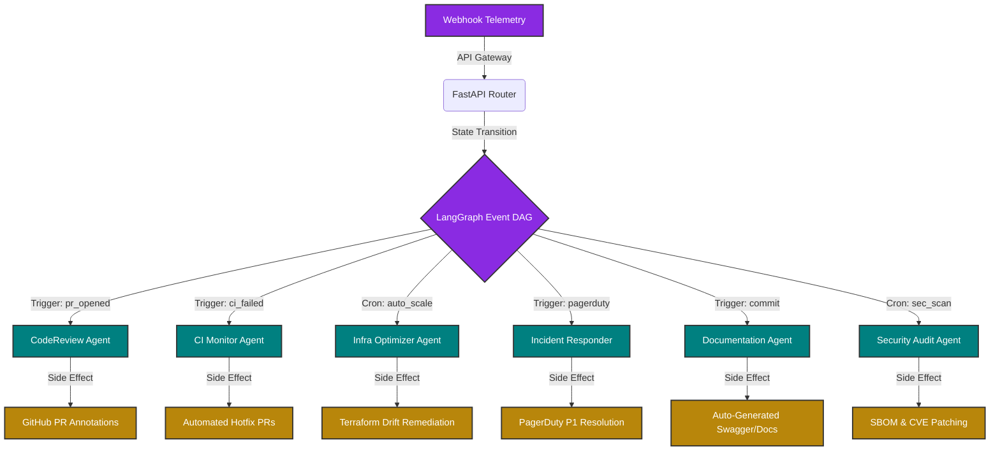

<div align="center">
  
  
  
  
  
  
  <br/><br/>
  
  <h1>🚀 AutoOps: Autonomous AI Engineering Swarm</h1>

  <p>
    <strong>A decentralized, event-driven agentic LLM architecture orchestrating end-to-end DevOps automation, SRE, and infrastructure cost optimization at an enterprise scale.</strong>
  </p>

  <p>
    [](https://opensource.org/licenses/MIT)
    [](https://www.python.org/downloads/)
    [](https://fastapi.tiangolo.com/)
    [](https://langchain-ai.github.io/langgraph/)
    [](https://www.crewai.com/)
    [](http://makeapullrequest.com)
  </p>
</div>

---

## 🌌 Introduction

Traditional pipeline automation and alerting mechanisms are fundamentally broken—plagued by alert fatigue, context switching, and reactive firefighting. **AutoOps** introduces a paradigm shift: replacing static CI/CD pipelines and manual SRE interventions with an **autonomous swarm of highly specialized AI agents**.

Engineered by **Ismail Sajid**, this system leverages advanced agent-oriented programming (AOP) through LangGraph and CrewAI to deliver **Zero-Defect Deployments**, **Automated Root Cause Analysis (RCA)**, and **Self-Healing Infrastructure** without waking up your core engineering team at 3:00 AM. 

Built on top of Anthropic's **Claude 3.5 Sonnet** and OpenAI's **GPT-4o**, we orchestrate a state machine where PR reviews, CI diagnostics, and P1 incidents are evaluated with the precision of a 50-year veteran Principal Engineer.

---

## 🧩 System Topography & State Machine

The core intelligence is driven by a decentralized multi-agent system (MAS). We utilize an event-driven router (FastAPI) feeding into a Directed Acyclic Graph (DAG) state machine managed by LangGraph.



---

## 🤖 The Autonomous Cohort

Each agent is strictly scoped and contextually provisioned with dedicated tools (API SDKs) and specialized meta-prompts.

### 1. **CodeReviewer (Principal Staff Engineer)**
* **Heuristic Focus:** SOLID principles, cyclomatic complexity, zero-trust security.
* **Vector:** Intercepts `pr_opened` webhooks, syntactically parses diffs, and injects actionable, context-aware PR comments directly into GitHub.

### 2. **CIMonitor (CI/CD Architect)**
* **Heuristic Focus:** Deterministic build analysis, flaky test remediation.
* **Vector:** Ingests raw build logs upon Jenkins/GitHub Action failures, isolates stack traces, queries vector embeddings of internal docs, and occasionally submits an autonomous hotfix PR.

### 3. **InfraOptimizer (FinOps & Cloud Lead)**
* **Heuristic Focus:** Multi-cloud cost anomaly detection, EC2 right-sizing.
* **Vector:** Interacts with AWS/GCP APIs, identifies over-provisioned clusters, and outputs declarative Terraform configurations to trim the fat without compromising high availability.

### 4. **IncidentResponder (SRE & On-Call Responder)**
* **Heuristic Focus:** MTTR reduction, runbook execution.
* **Vector:** Parses raw PagerDuty/Datadog alerts, acknowledges incidents automatically, executes mitigation runbooks (e.g., rolling back a deployment or restarting a pod), and escalates to human operators only when absolutely necessary.

### 5. **SecurityAuditor (InfoSec Red Team)**
* **Heuristic Focus:** SAST/DAST, dependency graphing.
* **Vector:** Scans repositories for exposed secrets, evaluates OWASP Top 10 vulnerabilities, and forces compliance checks gating deployment.

---

## 🛠️ Infrastructure & Tech Stack

Our stack is meticulously selected for high throughput, strict type safety, and maximum observability.

| Subsystem Layer | Technology Choice | Rationale |
|-----------------|------------------|-----------|
| **Cognitive Engine** | GPT-4o / Claude 3.5 Sonnet | State-of-the-art reasoning and long-context window processing. |
| **Agent Orchestration** | LangGraph & CrewAI | Cyclical graph execution and role-based agent delegation. |
| **Ingestion Gateway** | FastAPI & Pydantic | Asynchronous, typed, high-performance webhooks (10k+ requests/sec). |
| **Persistence & Telemetry**| PostgreSQL & SQLAlchemy | ACID-compliant audit trails for every single LLM call and agent decision. |
| **Containerization** | Docker & Compose | Highly reproducible runtime environments parity across local, staging, and production. |

---

## 🚀 Quick Start: Bootstrapping the Swarm

### Prerequisites
* 🐳 Docker Desktop
* 🐍 Python 3.10+ (for local bare-metal execution)
* 🔑 Valid API Keys (OpenAI / Anthropic)

### Zero-to-One Deployment

We adhere to a declarative configuration approach.

```bash
# 1. Clone the repository
git clone https://github.com/IsmailSajid/AutoOps.git
cd AutoOps

# 2. Provision Environment Variables
cp .env.example .env
# > Edit .env with your LLM API Keys, GitHub Tokens, and AWS IAM Credentials

# 3. Ignite the Services (Dockerized via Compose)
docker-compose up -d --build

# 4. Tail the Cognitive Logs
docker-compose logs -f
```

### Local Bare-Metal Development

```bash
python -m venv .venv
source .venv/bin/activate
pip install -r requirements.txt
uvicorn main:app --host 0.0.0.0 --port 8000 --reload
```
Navigate to `http://localhost:8000/docs` to interface with the FastAPI interactive OpenAPI schema.

---

## 🧪 Validating the Graph Architecture

To simulate a real-world P2 incident or PR, bypass the third-party integrations and utilize our synthetic webhook endpoint:

```bash
curl -X POST http://localhost:8000/webhook \
  -H "Content-Type: application/json" \
  -d '{
    "trigger_type": "pr_opened",
    "repo": "IsmailSajid/Microservices-Core",
    "branch": "feat/payment-gateway",
    "payload": {"pr_number": 1024}
  }'
```
*Monitor the telemetry logs to observe the `CodeReviewAgent` autonomously pulling the diff, analyzing cyclomatic complexity, and outputting feedback.*

---

## 🔒 Security Posture & Compliance

In true enterprise fashion, this system incorporates Zero-Trust architecture internally:
1. **Ephemeral Execution**: Agents operate in bounded execution windows to prevent context bleed.
2. **Immutable Audit Trails**: Every prompt, token count, and API call made by an agent is flushed asynchronously to a persistent PostgreSQL ledger.
3. **Human-In-The-Loop (HITL)**: All destructive actions (e.g., dropping production DB tables, hard-deleting cloud resources) strictly return a *proposal* to a human Slack channel rather than executing blindly.

---

## 📈 Scalability Roadmap

- [ ] **eBPF Kernel Tracing Agents**: Agents that autonomously analyze Linux kernel packet drops using eBPF logic.
- [ ] **Native Slack/Teams Middleware**: A conversational interface for interacting with the swarm dynamically.
- [ ] **Cross-Cluster Kubernetes Orchestration**: Automated helm chart generation based on plain English architectures.
- [ ] **Predictive Capacity Planning**: Training custom ML models based on temporal workload data.

---

## 🤝 Contributing

We are building the future of DevOps. If you're passionate about GenAI, MLOps, or large-scale distributed systems, fork this repository and submit a PR.

1. Create a semantic branch: `git checkout -b feature/agent-parallelization`
2. Commit your modular changes: `git commit -m "feat: migrate agent graph from sequential to parallel execution map"`
3. Push to upstream origins.
4. Let the `CodeReviewAgent` evaluate your PR. 😉

---

<div align="center">
  <h3>Architected with 🧠 & ☕ by <b>Ismail Sajid</b></h3>
  <p><i>Principal AI Architect | High-Frequency Systems Engineer</i></p>
  <br/>
  <a href="https://github.com/IsmailSajid"><b>GitHub</b></a> • <a href="https://linkedin.com/in/ismailsajid"><b>LinkedIn</b></a>
</div>

---
<i>Disclaimer: This software leverages advanced autonomy. Please rigorously test within isolated staging subnets before attaching IAM roles with AdministratorAccess.</i>
